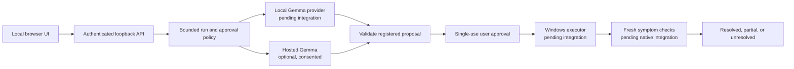

# TroubleShoot

> A local-first Windows troubleshooting assistant that helps people investigate a problem, review a proposed action, and check whether the symptom changed.

## Team

**Team Name:** DROS

| Member | Contribution recorded in this repository |
| --- | --- |
| Pranesh Subramanian (Member 1) | Assigned: Windows tools, selected-window interaction, and Windows guest validation. Completed work is not verified in this checkout. |
| Umasuthan Palaniappan (Member 2) | Assigned: local Gemma provider and agent reasoning. Completed work is not verified in this checkout. |
| Srinath Balakrishnan (Member 3) | Implemented the shared contracts, backend API/session flow, hosted Gemma adapter, minimal UI, packaging, setup documentation, and synthetic tests on `member-3/backend-hosted-api`. |
| Sanjeev Singotam (Member 4) | Assigned: project documentation, demo preparation, and submission checklist. Completed work is not verified in this checkout. |

Member assignments are not proof that another branch's work has been integrated. The verified Member 3 work and limits are recorded in [validation notes](docs/MEMBER_3_VALIDATION.md).

## Problem Statement

### The Problem

When a Windows application or service behaves unexpectedly, people often have to interpret diagnostic advice, decide which actions are safe, and determine whether those actions fixed the original symptom. Some Windows troubleshooters already offer automated repairs; the challenge is helping users follow a clear, controlled troubleshooting flow and see evidence of its result.

### Why We Chose This Problem

The team wants to make troubleshooting easier to follow while keeping consequential actions visible and under user control. The project is an early, limited step toward that goal; it does not claim to fix every Windows problem.

## Solution

TroubleShoot is being built as a local-first assistant. Its intended flow gathers relevant evidence, asks a Gemma model for a bounded proposal, checks the proposal against registered operations, requests approval where needed, and then measures the result. A model proposal or successful tool call alone does not establish that a problem was fixed.

### Key Features

- Implemented: authenticated loopback API, run events, cancellation, and specific single-use approval for a proposed action.
- Implemented: optional hosted Gemma 4 transport. The user must explicitly consent before complaint text is sent; the API key stays on the backend.
- Implemented: minimal browser interface for diagnosis, provider status, event timeline, approval, Stop, and truthful result/recovery display.
- Pending integration: local Gemma, native Windows tools, selected-window capture, persistent recovery, and live repair verification.

The current launcher reports local Gemma as unavailable because its adapter is not integrated in this branch. Hosted inference requires a configured API key and successful real model access. Test fixtures are explicitly labeled synthetic and are never silently substituted for a model.

## Innovation and Differentiation

The intended contribution is a conversational workflow that combines model suggestions with registered operations, user approval, and fresh symptom checks. Windows already has automated troubleshooters; this project does not claim that automated repair itself is new. The integrated Windows workflow and its practical value remain to be demonstrated.

## Technical Implementation

### Architecture

The Member 3 branch implements the loopback API, hosted transport, session policy, and browser interface. The local provider and native Windows executor are integration points whose owning members' work is not verified here.



### Technology Stack

| Category | Technologies / status |
| --- | --- |
| Frontend | HTML, CSS, and vanilla JavaScript; local browser UI implemented |
| Backend | Python 3.11+; FastAPI and Uvicorn loopback API implemented |
| Database | N/A; run state and events are kept in process memory |
| AI / ML | Hosted Gemma 4 adapter for `gemma-4-26b-a4b-it` or `gemma-4-31b-it`; real inference not yet verified. Local Gemma is assigned to Member 2 and not integrated here. |
| Infrastructure | Local Windows development; server binds to `127.0.0.1`; no hosted application deployment or VM repair evidence |
| APIs / Services | Google Gemini API's hosted Gemma endpoint, optional and key-gated; no real request has been verified |

### How It Works

The API accepts a complaint and diagnosis/repair mode, reports provider readiness, and streams run events. Model output is parsed against registered operation validators. A mutation is only considered in repair mode and waits for a one-time approval bound to the run, action, arguments, target, and observation. The runtime rechecks observation freshness and target geometry before execution. Separate checks determine whether the result is resolved, partial, or unresolved.

The API and UI are wired to injectable provider and executor interfaces. The production launcher currently has neither a working local provider nor a native Windows executor configured, so it honestly reports those capabilities as unavailable. Browser vision and screenshot transfer are not enabled. Hosted image transport code is consent-gated and covered by mocked transport tests, not integrated into the UI.

### Technical Decisions

- Local Gemma is the intended default; hosted Gemma is optional and requires explicit text-sharing consent. Image consent is separate.
- The model may propose a registered action, but deterministic validation and user approval control whether a mutation runs.
- Diagnose mode cannot perform registered mutating operations. A new observation is checked immediately before execution, and stale or changed targets fail closed.
- Completion distinguishes resolved, partial, unresolved, cancelled, and error outcomes. Execution success alone is not repair success.
- Development fixtures are synthetic and visibly labeled. Missing model credentials or providers produce errors instead of mock inference or silent fallback.
- This is a single-user loopback development application, not a hardened remote service. Run state and recovery indicators are in memory; persistent recovery is not implemented.

## Implementation During the Hackathon

The Member 3 branch contains newly authored backend, hosted-provider transport, browser UI, packaging, contracts, setup documentation, and fixture-based validation. The full suite passed with **52 Python tests and 5 JavaScript UI tests**. The browser smoke check used a synthetic target and returned **unresolved**; it did not demonstrate a live Windows repair or real model inference. See [Member 3 validation notes](docs/MEMBER_3_VALIDATION.md) and [setup and limitations](docs/MEMBER_3_SETUP.md).

This repository's provenance notes state that the implementation was started afresh after the team withdrew permission to reuse its earlier prototype. No earlier application source or Git history was imported. This is not a claim that the team had no prior prototype or prior experience.

### Team Contributions

- **Pranesh Subramanian:** assigned the Windows executor, desktop interaction, and guest validation. The contribution and results need confirmation from Member 1's branch.
- **Umasuthan Palaniappan:** assigned the local Gemma provider and agent reasoning. The contribution and inference evidence need confirmation from Member 2's branch.
- **Srinath Balakrishnan:** Member 3 backend/API, session approvals and cancellation, hosted Gemma adapter, browser UI, shared contracts, packaging, documentation, and synthetic validation, as recorded on this branch.
- **Sanjeev Singotam:** assigned documentation, demo preparation, and submission support. The contribution needs confirmation from Member 4's branch.

## Working Application

**Live Application:** N/A. The application is a local Windows program; there is no public deployment. The UI can be started locally using the instructions below. In the current checkout, providers are unavailable unless hosted Gemma credentials are configured; the local provider and Windows executor still require integration.

The included synthetic browser fixture demonstrates event display and an honest unresolved result only. It does not change the host or verify a Windows repair.

## Demo Video

**Demo Video:** Not recorded or provided in this repository.

## Open Source and AI Usage

### AI / Models

- **Gemma 4 hosted API:** the backend adapter supports the documented Gemma 4 IDs `gemma-4-26b-a4b-it` and `gemma-4-31b-it`. A real API key, account availability, and successful inference have not been verified. Selecting hosted mode requires explicit consent for sending complaint text to Google's API.
- **Local Gemma 4:** intended as the default provider, but its adapter is not present in this branch and no local inference is claimed.

### Open Source Components

- **FastAPI:** backend HTTP API.
- **Uvicorn:** local ASGI server.
- **HTTPX:** bounded hosted API transport and mocked transport tests.
- **Setuptools:** Python package build configuration.
- **Dataset:** N/A; no dataset is included or used by the implemented tests.

The application code is distributed under the repository's MIT License. External packages and model/API terms remain subject to their respective upstream licenses and terms. See [Google's Gemma API guide](https://ai.google.dev/gemma/docs/core/gemma_on_gemini_api) for the hosted Gemma integration reference.

## Setup and Usage

### Prerequisites

- Git.
- Python 3.11 or later.
- Node.js for the JavaScript UI behavior tests (not needed to run the UI).
- A hosted Gemma API key only if you want to try hosted inference; no key is included.

### Installation

```powershell
git clone https://github.com/Team-DROS/TroubleShoot.git
cd TroubleShoot
git switch member-3/backend-hosted-api
python -m venv .venv
.\.venv\Scripts\python -m pip install -r requirements.lock
```

### Environment Variables

Set `GEMMA_API_KEY` in the backend environment to enable hosted inference. Optionally set `GEMMA_API_MODEL` to `gemma-4-26b-a4b-it` or `gemma-4-31b-it`. `TROUBLESHOOT_SESSION_TOKEN` optionally sets the local session token; if unset, the launcher generates one. Never commit API keys or place them in browser code. `.env.example` contains placeholders; the app does not automatically load a `.env` file.

### Running the Project

```powershell
.\scripts\start.ps1
```

Open `http://127.0.0.1:8765` and enter the local session token printed by the launcher. The server binds only to loopback. See [Member 3 setup notes](docs/MEMBER_3_SETUP.md) for hosted configuration, packaging, and current limitations.

To run the automated checks:

```powershell
.\scripts\test.ps1
```

### Usage

Connect with the local session token, describe a symptom, select a mode and provider, and start a run. For hosted mode, explicitly consent before sending complaint text. Review the event timeline and any proposed action; approve or reject that specific action. Use Stop to request cancellation. Read the final verdict and recovery state as limited to the checks actually performed.

For a clearly labeled synthetic browser run, see the fixture instructions in [Member 3 setup notes](docs/MEMBER_3_SETUP.md). Do not interpret it as real inference or Windows repair evidence.

## Challenges and Learnings

The backend and UI can be developed without a local model or Windows VM by injecting test providers and executors. That keeps interface and policy tests available while live integration is pending. The work also makes clear that consent, action approval, fresh target checks, deterministic verification, and recovery are separate responsibilities; a successful API request or tool call cannot stand in for measured repair evidence.

## Devpost Submission

**Devpost Project:** N/A; no submission link or acceptance record is present in this repository. Confirm the event's required submission route before submitting. No submission is claimed.

## Credits and License

### Credits

- The README structure follows the member-provided hackathon project template: [Hacktoberfest Hack Day Coimbatore template repository](https://github.com/BIJJUDAMA/hacktoberfest-hack-day-coimbatore-x-init-club-and-idea-club). The template's application code was not copied.
- The hosted Gemma adapter follows Google's [Gemma with the Gemini API documentation](https://ai.google.dev/gemma/docs/core/gemma_on_gemini_api).
- FastAPI, Uvicorn, HTTPX, and the other pinned packages are external dependencies; their own notices and licenses apply.

### License

[MIT License](LICENSE) for this repository's application code. This does not change the terms for model weights, external services, Windows, or third-party dependencies.

## Submission Checklist

- [x] Project title, description, team names, problem, solution, architecture, and stack documented.
- [x] Member 3 setup and synthetic validation documented.
- [x] Limitations and unverified integrations identified.
- [ ] Confirm actual contributions and evidence from Members 1, 2, and 4.
- [ ] Run real hosted Gemma inference with an authorized key/account.
- [ ] Integrate and test the local Gemma provider and native Windows executor.
- [ ] Record a verified Windows workflow and recovery evidence.
- [ ] Add a demo video and submission link if required and provided.
- [ ] Confirm the current submission route and acceptance with the team.
