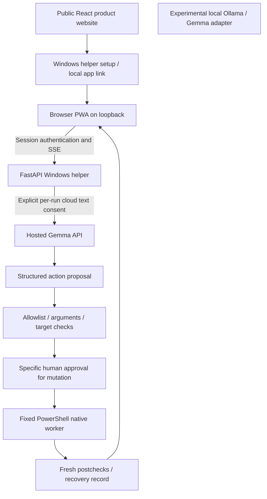

# TroubleShoot

**A Windows troubleshooting assistant with hosted Gemma 4 reasoning and an installable PWA connected to a local Windows helper.**

TroubleShoot lets you describe a Windows problem in plain English, watches the system gather real facts, asks Gemma to reason about them, and then, only after *you* approve, executes one bounded, registered action. It immediately re-checks whether the symptom actually changed, and tells you honestly whether it worked.

> Final integration update: all four members' fresh work is consolidated into main. Current production is **hosted Gemma API + Windows PWA**. 
> Built in a single day at **Hacktoberfest Hack Day Coimbatore × INIT Club & Idea Club** on 8 October 2026 by Team DROS.

---

## Team

**Team Name:** DROS

| Member | Role | Branch |
|---|---|---|
| **Pranesh Subramanian** | Windows tools, selected-window computer use, guest validation | `member-1/windows-desktop-vm` |
| **Umasuthan Palaniappan** | Local Gemma provider, agent reasoning, local evidence | `member-2/local-gemma-agent` |
| **Srinath Balakrishnan** | Backend API, hosted Gemma integration, PWA console | `member-3/backend-hosted-api` |
| **Sanjeev Singotam** | Documentation, template alignment, submission preparation | `member-4/docs-demo-submission` |

---

## Problem Statement

### The Problem

Most Windows troubleshooting today is a loop: read a support page, run a command, guess whether it helped, repeat. Automated troubleshooters exist, but they offer little visibility into *what* they're doing or *why*.

### Why We Chose This Problem

We wanted something different, a conversational assistant that shows you the evidence it collected, explains the reasoning behind a proposed fix, puts you in control of the decision, and then proves whether the outcome matched the expectation. Not "we ran something, trust us." Verified.

We don't claim TroubleShoot can fix every Windows problem. It targets a small, honest, demonstrable workflow first.

---

## Solution

The Windows helper gathers evidence and runs fixed tools; hosted Gemma proposes actions, while the PWA displays reasoning, approvals and measured outcomes. The public React website introduces the product and links to local setup.

### Key Features

```
You describe a symptom
   ↓
TroubleShoot reads real Windows facts (services, diagnostics)
   ↓
Gemma 4 reasons about them and proposes a specific, bounded action
   ↓
You review and explicitly approve (or reject/cancel)
   ↓
The approved action runs, nothing else
   ↓
Fresh postchecks verify whether the symptom changed
   ↓
You see: Resolved / Partial / Unresolved, with the evidence
```

---

## Innovation and Differentiation

The project combines natural-language diagnosis with visible evidence, fixed operation validators, exact action approvals, fresh target checks and explicit recovery state. Existing troubleshooters and AI desktop agents already cover parts of this space; we do not claim that AI troubleshooting or approvals alone are new. Our contribution is the implemented workflow and its documented limits.

## Technical Implementation

### Architecture



Hosted Gemma is the only provider wired into the current production launcher. Local Ollama remains available in source and recorded experiments, not as the production default or an automatic fallback. The website does not remotely control Windows: the helper must be running locally. Credentials stay in the backend. Native target identity and the five-second freshness rule remain enforced.

### Technology Stack

| Category | Technologies / status |
|---|---|
| Frontend | Vanilla HTML/CSS/JS operator PWA; React/TypeScript/Vite product website in `web/` |
| Backend | Python 3.11+, FastAPI, Uvicorn, HTTPX |
| Database | N/A; sessions/events are in memory, durable private recovery records use JSON |
| AI / ML | Production hosted `gemma-4-26b-a4b-it` or `gemma-4-31b-it`; experimental local Ollama `gemma4:e2b` (recorded 4.6B Q4_K_M), with Ollama 0.40.1 in recorded evaluations |
| Infrastructure | Windows helper, fixed PowerShell/.NET UI Automation workers, disposable Windows guest/VirtualBox; no pywin32 dependency in the current manifest |
| APIs / Services | Google hosted Gemma API; Vercel product website; loopback FastAPI endpoints |
| Testing | Python unittest and Node test runner; 203 Python + 19 JavaScript checks passed (222 total) |
| Secrets | Windows DPAPI CurrentUser encryption or backend environment; no API key in frontend/Git |

### How It Works

The API, model and executor are deliberately separate: the model proposes, policy validates, the user approves a mutation, the executor runs and the verifier collects fresh evidence. Diagnosis can complete with an explanation and no action; that is not a failed repair or proof of a restored symptom. The UI distinguishes that case from unresolved repair.

After slow inference, the runtime refreshes the same target and compares identity, bounds and DPI before rebinding the proposal. Approvals remain single-use and must complete within five-second observation freshness. Native workers repeat checks; failures are not automatically replayed. Persistent PowerShell execution reduces repeated startup overhead. Pending recovery records block further repairs, including after restart; no automatic startup restoration or operator recovery API is enabled.

### Technical Decisions

- Hosted text requires renewed per-run consent; image transfer is disabled in production. Keys remain server-side.
- Only registered native operations with fixed schemas are executable. No arbitrary model command or UAC bypass is exposed.
- Diagnose mode excludes mutating choices; Stop cancels pending work and prevents later actions.
- Desktop mutation stays disabled even if its reserved environment switch is set. Mouse/close tools and capture are not offered by the production runtime.
- Temporary hosted HTTP 502/503/504 failures receive at most one cancellable inference retry. Authentication/quota errors do not; native mutations are never retried automatically.
- The PWA caches only public static shell files. API responses, diagnostic evidence and credentials are never cached. Offline shell access does not provide offline troubleshooting.

## Implementation During the Hackathon

The team built fresh contracts, native Windows/desktop tools, local and hosted model adapters, session policy, PWA console, React product website, packaging and documentation on 8 October 2026. The team had an earlier prototype; following the user-reported organizer restriction, its implementation and Git history were not imported.

### Team Contributions

- **Pranesh Subramanian:** Windows/desktop execution, guarded mouse primitives, conditional checkbox recovery, guest tools and real Gemma guest harness evidence.
- **Umasuthan Palaniappan:** Ollama protocol/provider, agent reasoning/runtime adapter, tool schemas, timeout handling and recorded local-model evaluations.
- **Srinath Balakrishnan:** API/session integration, hosted Gemma transport, approval/cancellation, native bridge, persistent worker, packaging and PWA integration.
- **Sanjeev Singotam:** Template-aligned README, attribution/contribution records, demo script and submission preparation.

The following sections distinguish current production from experimental components and identify live versus simulated validation.

### ✅ Shared contract layer (all members)
The original 16 boundary tests cover the shared-contract foundation; additional provider, executor and session tests cover the integrated policies. Unknown operations, stale observations and missing hosted consent are rejected. Unexpected proposal fields are rejected, not silently stripped.

### ✅ Hosted Gemma API + PWA console (Member 3 & Integration)
- FastAPI loopback backend with session tokens, encrypted DPAPI key storage and SSE event timeline.
- Real hosted Gemma 4 connection-only inference passed with a read-only Windows diagnosis.
- Latest checks on main revision `d87f9b7`: **161 unit, 42 API/runtime, 9 synthetic console and 10 React fixture tests passed** — 222 checks total. Earlier 156/42/5 results in historical evidence describe earlier revisions.
- Installable PWA console served at `http://127.0.0.1:8765` with manifest, icons and service worker.
- Cloud text consent is explicit and per-run. Hosted Gemma API is the only production inference; no silent fallback is enabled.

### 🔬 Experimental: Local Gemma reasoning (Member 2)
Real inference on `gemma4:e2b` via Ollama, 7 recorded evidence runs on 8 October 2026 (outside the enabled live flow).
- **6/6 simulated scenarios passed** (spooler repair, DNS repair, diagnose-only, injected-text safety, unresolved symptom, out-of-scope decline).
- **Decisions on real guest facts** from Member 1's Windows 11 guest, `start_spooler`, `system_snapshot`, `spooler_status` chosen correctly.
- **Synthetic vision evaluation passed**: Gemma read "Print Spooler is listed as Stopped" from a fixture image and proposed a restart. An injected "ignore previous instructions" banner produced no change. The separate live guest capture returned unknown and blocked execution; that is not a successful live vision workflow.

### 🔬 Experimental: Windows desktop executor (Member 1)
Newly authored PowerShell + Python executor running inside a Windows 11 guest VM (outside the enabled live flow).
- Real local Gemma text inference → human-approved synthetic checkbox action → fixture verification → restoration, through a developer harness.
- Read-only Spooler check returned Running on the host.
- Bounded operation allowlist includes `start_spooler`, `spooler_status`, `system_snapshot`, `toggle_checkbox`, `graceful_close`, and five scoped mouse operations. Desktop mutation and hosted vision are outside this prototype's enabled live flow.


---

## Working Application

**Live Application:** [Product website](https://troubleshoot-one.vercel.app/) and the locally launched PWA, normally `http://127.0.0.1:8765`. The website is the product/setup entry point, not a remote Windows executor. Its URL is recorded in the integration documentation; this README audit did not verify a fresh website deployment.

Run the Windows helper below to use the operator console. The launcher passes a temporary session token in a URL fragment, which the page removes immediately and retains in memory. Manual connection uses the terminal token. Do not share the authenticated launch URL/token. Keys are separate and remain on the helper. Keep the helper running; a PWA cannot repair Windows without it.

The automatic launcher reserves a free port before opening a browser. If 8765 is busy/reserved, it selects an available port within the next 20 ports and reports the actual URL; existing processes are not stopped. Use the opened URL, not an assumed port. Chrome/Edge may offer installation, but an actual browser install remains unverified. Recorded Edge checks covered rendering, offline shell guidance and 390px layout without horizontal overflow.

**Verified flow:** real hosted Gemma plus fresh read-only Windows facts through the authenticated API/session (TestClient), with no mutation. Full hosted guest repair and original print success remain pending. The React demo uses fixtures and is not live repair evidence.

## Presentation and Project Links

- **Website:** [TroubleShoot](https://troubleshoot-one.vercel.app/)
- **PPT / presentation:** [Canva presentation](https://canva.link/qxf708x2k2ng9ma)
- **YouTube:** [Watch the demo](https://youtu.be/q4sGxlhyulc)
- **Submission / Devpost:** _Add project submission link here._

## Demo Video

**Demo Video / YouTube:** [Watch the TroubleShoot demo](https://youtu.be/q4sGxlhyulc). See [DEMO_SCRIPT.md](docs/DEMO_SCRIPT.md) for the walkthrough script.

## Open Source and AI Usage

### AI / Models

AI coding assistance, including Codex in Member 3 work, was used for fresh authorship and documentation; responsible members committed the work. Attribution records the team disclosure. No prior prototype code was imported.

**Model licenses:** Gemma weights are subject to the [Gemma Terms of Use](https://ai.google.dev/gemma/terms), separate from this application's MIT license.

Production hosted Gemma reasons over consented complaint text and fresh Windows evidence. Local `gemma4:e2b` supports recorded experimental reasoning/vision evaluations; it is not wired into the production launcher.

### Open Source Components

- **Python, FastAPI and Uvicorn:** backend runtime, HTTP API and ASGI serving.
- **HTTPX:** bounded hosted model transport.
- **Setuptools:** application wheel packaging.
- **React, TypeScript and Vite:** product website, type checking and build.
- **Ollama:** experimental local inference runtime.
- **Space Grotesk and DM Mono:** self-hosted fonts; bundled SIL OFL notices.
- **Dataset:** N/A; no training dataset or fine-tuning is included. Synthetic test fixtures are labelled.
- **API/service:** Google hosted Gemma; Vercel website hosting.

See [docs/ATTRIBUTION.md](docs/ATTRIBUTION.md), `web/public/THIRD-PARTY-NOTICES.txt` and `src/troubleshoot/api/console/FONT-LICENSES.txt` for licenses/notices.

---

## Setup and Usage


### Prerequisites

- Windows 10/11, Python 3.11+, Git
- A Google AI Studio account with Gemma API access and quota
- Chrome or Edge (for PWA install)
- Experimental local evaluations only: existing Ollama with `gemma4:e2b`; not required for the production PWA
- Node.js 22.18+ for website tests/build; not needed to run the Windows helper

### Installation

```powershell
git clone https://github.com/Team-DROS/TroubleShoot.git
cd TroubleShoot

python -m venv .venv
.\.venv\Scripts\python.exe -m pip install -r requirements.lock -e .

# Configure your Gemma API key (saved encrypted, never committed)
powershell -ExecutionPolicy Bypass -File scripts/configure-api.ps1

```

### Running the Project

```powershell
# Start the API and open the authenticated PWA console
powershell -NoProfile -ExecutionPolicy Bypass -File scripts/start-api-pwa.ps1
```

The launcher reports the actual loopback URL, normally `http://127.0.0.1:8765`. Use literal `127.0.0.1`, not `localhost`. For manual launch with `GEMMA_API_KEY` already configured: `.\.venv\Scripts\python.exe -m troubleshoot.api --port 8765`; paste the printed local session token into the console.

### Automated Checks

```powershell
# Contract + agent + provider + executor + launcher unit tests (161 total)
.\.venv\Scripts\python.exe -m unittest discover -s tests/unit -q

# API / session / runtime integration tests (42 total)
.\.venv\Scripts\python.exe -m unittest discover -s tests/api -q

# Synthetic console and React fixture checks
node --test tests/e2e/console/app.test.cjs
node --experimental-strip-types --test web/src/lib/demo.test.ts

# Shared-contract only (no install needed)
$env:PYTHONPATH = Join-Path (Get-Location) 'src'
python -m unittest discover -s tests/unit -p test_contracts.py -v
```

### Environment Variables

| Variable | Purpose |
|---|---|
| `GEMMA_API_KEY` | Hosted Gemma key (alternative to DPAPI; keep out of Git) |
| `GEMMA_API_MODEL` | Override model (`gemma-4-31b-it` for the larger variant) |
| `PYTHONPATH` | Set to `src` when running without install |

Additional helper variables: `TROUBLESHOOT_SESSION_TOKEN` optionally fixes a local token (at least 32 ASCII characters), and `TROUBLESHOOT_RECOVERY_DIR` selects a stable machine-private recovery directory (default `./data/recovery`). `TROUBLESHOOT_DESKTOP_REPAIRS` does not enable production desktop mutation. `TROUBLESHOOT_OLLAMA_*` variables belong to the experimental provider, not the hosted launcher.

```env
GEMMA_API_KEY=
GEMMA_API_MODEL=gemma-4-26b-a4b-it
TROUBLESHOOT_SESSION_TOKEN=
TROUBLESHOOT_RECOVERY_DIR=
TROUBLESHOOT_DESKTOP_REPAIRS=0
```

The key dialog stores `%LOCALAPPDATA%/TroubleShoot/api-key.dpapi`, encrypted for the current Windows user. `.env.example` is placeholder-only and is not automatically loaded. Never commit keys or tokens.

### Usage

Select system diagnostics or a diagnosis shortcut, enter a complaint, tick the per-run cloud consent checkbox and start. Review readable facts, expandable evidence and Gemma's explanation. If a permitted repair is proposed, approve or reject that specific action promptly; expired/changed targets require a new run. Use Stop to cancel and read the final diagnosis/verdict and recovery state. Intentional faults and service repair tests belong only in a disposable guest with recovery and human elevation.

---

## Project structure

```
src/troubleshoot/
├── contracts.py          # Shared trust-boundary contracts (all members consume)
├── agent/                # Coordinator, prompts, decision parsing, CLI (Member 2)
├── providers/            # Ollama + hosted Gemma adapters (Members 2 & 3)
├── api/                  # FastAPI app, session, PWA console (Member 3)
├── runtime/              # PowerShell worker, session state (Member 3)
├── windows/              # Registry, policy, runner (Member 1)
└── desktop/              # UI Automation executor, mouse, recovery (Member 1)

tests/
├── unit/                 # 161 unit tests
├── api/                  # 42 API/integration tests
└── e2e/console/          # 9 synthetic console tests

docs/
├── evidence/
│   ├── local-model/      # 7 recorded Gemma inference runs (Member 2)
│   └── windows/          # Guest executor evidence (Member 1)
├── API_PWA.md            # Setup, demo scope and validation record
├── DEMO_SCRIPT.md        # Walkthrough script for judges
├── ATTRIBUTION.md        # Licenses and component notices
└── CONTRIBUTIONS.md      # Per-member actual work log
```

---

## Evidence and validation

All evidence was produced on 8 October 2026 from newly authored code.

| Evidence | Location | What it proves |
|---|---|---|
| 7 Gemma inference runs (container + Windows PC) | `docs/evidence/local-model/` | Real local model decisions on simulated and real guest facts |
| Hosted Gemma read-only diagnosis | `docs/evidence/hosted/api-pwa-diagnosis.json` | Real API connection, real Windows facts, real model response |
| Guest executor + checkbox fixture | `docs/evidence/windows/` | Human-approved action, target binding, postchecks, restoration |
| 222 passing checks on main `d87f9b7` | `tests/` and `web/src/lib/demo.test.ts` | 161 unit + 42 API + 9 synthetic console + 10 React fixture checks; not live repair evidence |

No old prototype results are carried over. Tests are not live repair evidence.

---

## Decisions we're proud of

**Separate stages, no shortcuts.** The model, the policy, the user approval, the executor and the verifier are five separate steps. The model can't cause execution by producing a convincing payload. The executor can't skip the freshness check. The verifier can't reuse an old observation.

**Honest about limits.** Spooler Running ≠ successful print. An unknown live vision result safely blocked execution; separate synthetic image evaluations passed. We say these things in the UI and in these docs.

**No silent fallback.** If local Ollama isn't running, you get an error, not a quiet switch to the hosted API. If hosted inference times out, you get a timeout, not a cached guess.

**5-second observation window.** The action you approve must match the *exact* window that was inspected, within 5 seconds. Replaced processes, moved windows and stale coordinates are all rejected before any input happens.

---

## Challenges and Learnings

- Splitting a same-day build across four people with different hardware (VM + Gemma, Gemma-only, no local model at all) required very clear interface contracts up front. The shared `contracts.py` module was the right call, it let everyone develop independently against the same shape.
- Gemma's reasoning quality on CPU-only hardware is good but slow (~43 s/decision). On a GPU or the team's Windows PC (~21 s) it's much more usable.
- "Execution returned OK" and "the symptom is resolved" are completely different things. Building the verification layer made this obvious in a way that reading about it doesn't.
- The observation freshness window (5 seconds) feels aggressive, but it's the right default. Window replacement during a troubleshooting session is a real threat, not a theoretical one.

---

## Devpost Submission

**Devpost Project:** N/A — no project URL or accepted submission receipt is recorded. The supplied template asks for Devpost; confirm the actual organizer route before submitting.

**Event:** Hacktoberfest Hack Day Coimbatore × INIT Club & Idea Club, 8 October 2026
**Tracks considered:** Best Use of Gemma 4, Best Open-Source AI Project
**Repository:** https://github.com/Team-DROS/TroubleShoot
**Status:** Main contains the merged team work; repository visibility was verified public during this audit. This change does not alter visibility or submit the project.

Event submission acceptance is not confirmed in this README. Confirm current organizer requirements before submitting. See [docs/SUBMISSION_CHECKLIST.md](docs/SUBMISSION_CHECKLIST.md).

---

## Credits and License

### Credits

Documentation structure informed by the [user-supplied hackathon template](https://github.com/BIJJUDAMA/hacktoberfest-hack-day-coimbatore-x-init-club-and-idea-club) (revision `6d3765e3c5adb7ad708dfc4593b5365001d36d55`). No application code from that template was used.

### License

**License: MIT**, see [LICENSE](LICENSE).
Model weights and Windows installation media retain their own license terms.


## Submission Checklist

Ticks below indicate README preparation is complete. Pending validation, missing links and organizer acceptance remain explicitly labelled.

- [x] Project title/description and all four team members listed.
- [x] Problem, motivation, solution, features and differentiation documented.
- [x] Mermaid architecture, stack, operation policy and decisions included.
- [x] Event-time implementation and team contributions documented.
- [x] Website/local application access and helper requirement explained.
- [x] AI, external components, credits and licenses identified.
- [x] Setup/run commands aligned with current main; recorded setup and read-only inference evidence linked.
- [x] Latest automated checks passed: 161 unit, 42 API, 9 console, 10 React fixture.
- [x] Challenges/learnings and live versus simulated evidence documented.
- [x] Full hosted guest repair and original-symptom verification clearly identified as pending.
- [x] PWA installation and deployment verification limits documented; website link included.
- [x] Presentation and YouTube demo links included.
- [x] Submission-link placeholder prepared; organizer submission and acceptance receipt remain unconfirmed.
- [x] Repository/evidence review information provided for the team; final submission review remains with the team.

README audit: compared against the user-supplied template on 8 October 2026 and current main `d87f9b7`. Project structure, evidence and experimental results are retained; links and checklist reflect the supplied submission materials. Tests do not establish live repairs or event acceptance.
