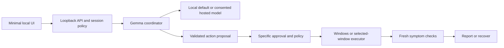

# TroubleShoot — Team DROS

A local-first Windows troubleshooting assistant being built with Gemma 4, bounded terminal/computer use, specific approvals, fresh verification and recovery.

**Current:** shared contract validation, synthetic fixture and 16 unit tests. **Pending:** model adapters, agent runtime, Windows executor, backend API and UI. No working repair/demo is claimed. This is a fresh implementation in a private repository; see [provenance](docs/PROVENANCE.md).

## Team

Team: Team DROS. Personal names are pending. These are assigned roles; completed contributions will be recorded from actual work.

| Member / resources | Assigned work | Branch / handoff |
|---|---|---|
| 1 / local Gemma + VM | Windows tools, selected-window computer use, guest validation | `member-1/windows-desktop-vm` — [assignment](docs/team/MEMBER_1.md) |
| 2 / local Gemma | Local provider, agent reasoning and text/vision tests | `member-2/local-gemma-agent` — [assignment](docs/team/MEMBER_2.md) |
| 3 / no local model/VM | Backend API, hosted provider, minimal UI and integration | `member-3/backend-hosted-api` — [assignment](docs/team/MEMBER_3.md) |
| 4 / lighter role | Documentation, template alignment, demo/submission preparation | `member-4/docs-demo-submission` — [assignment](docs/team/MEMBER_4.md) |

Read [PROJECT_CONTEXT.md](PROJECT_CONTEXT.md), [branch migration](docs/RESTART.md) and [shared contracts](docs/CONTRACTS.md).

## Problem Statement

Windows users often need to interpret diagnostic instructions, choose actions and check whether a symptom is fixed. Some Windows troubleshooters already perform automated repairs. We want a conversational assistant that coordinates supported tools and selected-window interaction, making action and outcome evidence visible.

### Why We Chose This Problem

Reduce manual troubleshooting effort while retaining control over impactful changes. Broad Windows support is the long-term goal; this hackathon build targets a small demonstrable workflow first.

## Solution

Planned flow: observe relevant facts, ask Gemma for a constrained decision, validate policy, obtain needed approval, execute a registered action, collect new symptom checks and recover or report unresolved results.

### Key Features

- Implemented: provider/consent and action/target validation contracts.
- Planned: local Gemma diagnosis and optional explicit hosted Gemma.
- Planned: bounded terminal and selected-window desktop actions.
- Planned: approval, cancellation, verification and recovery visible in the UI.

## Innovation and Differentiation

Our intended distinction is local-first conversational coordination across terminal and desktop workflows with measured outcomes. We do not claim that automated Windows repair itself is new or that this agent fixes every Windows problem.

## Technical Implementation

### Architecture

Proposed runtime workflow; only the shared-contract foundation exists so far:



### Technology Stack

| Category | Implemented technology / status |
|---|---|
| Frontend | N/A — minimal UI planned |
| Backend | Python 3.11+ shared contracts; server not implemented |
| Database | N/A |
| AI / ML | N/A — Gemma 4 local/hosted adapters planned |
| Infrastructure | N/A verified runtime — Windows/VM evidence pending |
| APIs / Services | N/A — loopback backend and hosted Gemma transport planned |

### How It Works

Current contracts reject missing/extra action fields, unknown operation names, invalid per-operation arguments, target mismatch and stale/future observations. Hosted text/image consent is explicit. Executors and session authorization still need implementation; parsing alone does not authorize input.

### Technical Decisions

Keep one provider interface, local inference as the final default, executor authority separate from model proposals and independent fresh postchecks. Development without a model uses clearly labeled fixtures; shipped runtime must never silently substitute simulated AI. The shared foundation currently uses only the Python standard library.

## Implementation During the Hackathon

Fresh planning and hardware-specific responsibilities, shared contracts, a synthetic fixture and 16 boundary tests are recorded in this repository. No earlier application code or Git history was imported. See [validation](docs/VALIDATION.md).

### Team Contributions

Actual per-person implementation contributions are pending confirmation. The role table above is an assignment, not an authorship report. Member 4 records real new commits/evidence as development proceeds.

## Working Application

Live application: N/A — no running app exists yet. The target is a local Windows application. Setup and judging access will be documented once verified; native-control endpoints should not be exposed publicly.

## Demo Video

Demo video: pending; none recorded or uploaded for this fresh project. Member 4 prepares a short script using newly verified team evidence.

## Open Source and AI Usage

### AI / Models

Gemma 4 through local Ollama is planned as the default, with explicit hosted Gemma support. Exact tags, account availability, model licenses and real text/image evidence are pending. No model inference is claimed for the current module.

### Open Source Components

Python standard library is used by the current contracts/tests. Setuptools is the declared packaging build tool. Other runtime libraries and their notices will be documented as implemented. No dataset is used.

## Setup and Usage

### Prerequisites

Python 3.11+ and Git for the current tests. Local Gemma and VM are needed only for their assigned technical roles, not for Member 3's API development or Member 4's documentation.

### Installation

```powershell
git clone https://github.com/Team-DROS/TroubleShoot.git TroubleShoot-Event
cd TroubleShoot-Event
```

No package installation is needed for the current standard-library tests.

### Environment Variables

Set `PYTHONPATH` to `src` for tests. Runtime/provider/key variables are not implemented yet; Member 3 documents them and adds a placeholder-only environment example when they work. Credentials never belong in source control or frontend bundles.

### Running the Project

There is no application startup command yet. Run the fresh shared-contract tests:

```powershell
$env:PYTHONPATH = Join-Path (Get-Location) 'src'
python -m unittest discover -s tests/unit -v
```

### Usage

Use the contracts and [synthetic example](docs/fixtures/inspect_target.json) for development. Fixtures are not live inference, windows or repair results.

## Challenges and Learnings

The split now matches actual hardware. API development can proceed with dependency-injected fixtures and hosted access when available; live guest tests remain with the VM owner. Capability/consent/observation validation must be distinct from execution approval and actual repair success.

## Devpost Submission

Devpost project: pending/not submitted. The supplied template has a Devpost field; the earlier event snapshot points to OrganizerHQ. Member 4 confirms the current required route and retains acceptance evidence. No portal completion is implied. See [submission checklist](docs/SUBMISSION_CHECKLIST.md).

## Credits and License

Documentation structure considers the [user-supplied hackathon template](https://github.com/BIJJUDAMA/hacktoberfest-hack-day-coimbatore-x-init-club-and-idea-club), inspected at `6d3765e3c5adb7ad708dfc4593b5365001d36d55`. See [template guide](docs/TEMPLATE_GUIDE.md). Its implementation is not copied. Application code uses the existing [MIT license](LICENSE); model weights and Windows media retain their own terms.

## Submission Checklist

- [x] Project goal, initial architecture and hardware-specific role split documented.
- [x] Fresh shared-contract tests pass.
- [ ] Real team names and completed contributions recorded.
- [ ] Application, actual Gemma integration and guest workflow verified.
- [ ] Setup/run/configuration instructions verified for the implemented app.
- [ ] Demo and final attribution documented.
- [ ] Required submission route and acceptance confirmed.
- [ ] Public release explicitly authorized where required.

Repository remains private until explicit user instruction. Submission is pending.
