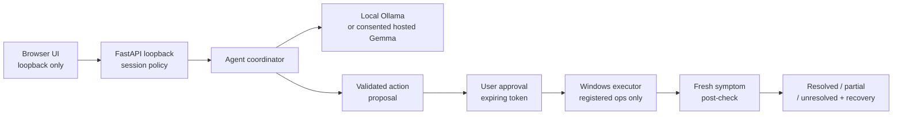

# TroubleShoot — Team DROS

> A local-first Windows troubleshooting assistant being built with Gemma 4,
> bounded terminal / computer-use actions, explicit per-action approval,
> fresh postcondition verification and recovery.

**Build date:** 8 October 2026 — fresh repository, no earlier prototype imported.
**Current state:** shared contract validation + 16 unit tests ✅ — runtime pending ⏳
**Repository:** private until explicit team authorization.

---

## Team

**Team name:** Team DROS

Member names are pending team confirmation; role slots are placeholders.
Completed contributions are recorded in [docs/CONTRIBUTIONS.md](docs/CONTRIBUTIONS.md).

| Role | Available hardware | Branch | Assignment |
|---|---|---|---|
| Member 1 | Local Gemma 4 + Windows VM | `member-1/windows-desktop-vm` | Windows executor, selected-window computer use, guest validation |
| Member 2 | Local Gemma 4 only | `member-2/local-gemma-agent` | Local Ollama provider, agent reasoning, local evidence |
| Member 3 | No local model / VM | `member-3/backend-hosted-api` | Backend API, hosted Gemma transport, minimal UI, integration |
| Member 4 | No local model / VM | `member-4/docs-demo-submission` | Documentation, template alignment, demo script, submission preparation |

Read [PROJECT_CONTEXT.md](PROJECT_CONTEXT.md), [AGENTS.md](AGENTS.md),
[docs/RESTART.md](docs/RESTART.md) and [docs/CONTRACTS.md](docs/CONTRACTS.md).

---

## Problem Statement

Windows users often need to interpret diagnostic output, decide on a remediation step
and then manually verify whether the symptom is resolved. Some built-in Windows
troubleshooters already automate narrow repairs, but they offer little visibility into
what they are doing or why. Our goal is a **conversational, local-first assistant**
that coordinates supported Windows tools and selected-window interaction, makes the
action and outcome evidence visible, and keeps the user in control of every impactful
change.

### Why We Chose This Problem

Manual Windows troubleshooting is time-consuming and error-prone. We want to reduce
that effort while retaining human control over consequential actions. Broad Windows
support is the long-term goal; this hackathon build targets one small, demonstrable
workflow first. We do not claim "fix any Windows problem."

---

## Solution

**Planned runtime flow:**

1. User describes a symptom in natural language.
2. The assistant observes relevant system facts (service state, process info, etc.).
3. Local Gemma 4 (via Ollama) proposes a bounded, registered action.
4. The contract layer validates the proposal — rejecting unknown operations and stale targets.
5. The user explicitly approves the single proposed action.
6. The Windows executor runs exactly the approved operation and immediately re-checks the symptom.
7. The UI reports resolved / partial / unresolved with fresh evidence. Recovery is available.

Local inference is the default. Text and images only leave the machine when the
user explicitly consents to hosted Gemma inference.

### Key Features

| Feature | Status |
|---|---|
| Provider / consent / action / target contract validation | ✅ Implemented (`src/troubleshoot/contracts.py`) |
| 16 boundary unit tests (stdlib, no install) | ✅ Implemented |
| Local Gemma 4 diagnosis via Ollama | ⏳ Planned — Member 2 |
| Bounded terminal action (e.g. service restart) | ⏳ Planned — Member 1 |
| Selected-window computer use with identity checks | ⏳ Planned — Member 1 |
| Per-action approval with expiring token | ⏳ Planned — Members 1 & 3 |
| Fresh postcondition verification | ⏳ Planned — Member 1 |
| Cancel / undo flow | ⏳ Planned — Members 1 & 3 |
| Loopback backend API with SSE events | ⏳ Planned — Member 3 |
| Minimal browser UI | ⏳ Planned — Member 3 |
| Opt-in hosted Gemma (Google AI API) | ⏳ Planned — Member 3, if key access available |

---

## Innovation and Differentiation

Our intended distinction is **local-first conversational coordination** across both
terminal and selected-window desktop workflows, with measured, verifiable outcomes.
Every proposed action passes a strict allow-list check; no model output can execute
an unregistered operation. The observation is bound to the target window's identity
(handle, PID, process start time) and expires in five seconds — ensuring the action
applies to the window that was inspected, not one that replaced it.

We do not claim that automated Windows repair is a new idea, or that this assistant
fixes every Windows problem.

---

## Technical Implementation

### Architecture

Proposed runtime workflow (only the shared-contract foundation currently exists):



### Technology Stack

| Category | Implemented | Planned |
|---|---|---|
| Language | Python 3.11+ (standard library) | — |
| Build | setuptools ≥ 68 | — |
| Backend API | — | FastAPI (Member 3) |
| Local AI | — | Ollama + Gemma 4 (Members 1 & 2) |
| Hosted AI | — | Google Gemma API, opt-in (Member 3) |
| Windows tools | — | pywin32 / subprocess allow-list (Member 1) |
| Browser UI | — | Minimal HTML/JS or TypeScript/React (Member 3) |
| Database | N/A | — |
| Infrastructure | Git, Python runtime | Windows VM (Member 1) |

### How It Works (contracts layer — implemented)

The currently implemented `contracts.py` module enforces trust boundaries before
any runtime component is reached:

- **`RunRequest`** — validates complaint text, mode (`diagnose` / `repair`),
  provider choice and explicit consent flags. Hosted inference requires
  `cloud_consent=True`; hosted images additionally require `cloud_images_consent=True`.
- **`parse_action`** — rejects payloads with unknown fields, unknown operation names,
  and invalid per-operation arguments (via executor-supplied validators).
- **`require_target`** — binds an action proposal to the exact window that was
  observed (handle, PID, process-start timestamp) and checks observation freshness
  (default 5-second window).
- **`event`** — produces typed SSE event envelopes with allowed event kinds only.

No model, executor, API or UI component exists yet.

### Technical Decisions

- **One provider interface** — local Ollama and hosted Gemma implement the same
  protocol; the application never silently falls back from local to hosted.
- **Executor authority separate from model proposals** — the model cannot cause
  execution by producing a plausible-looking payload; the executor allow-list and
  user approval gate are deterministic.
- **Independent postchecks** — execution `ok` means the OS accepted the command,
  not that the symptom is resolved. A separate fresh observation determines verdict.
- **Standard library only (current)** — the contracts module and tests require only
  Python 3.11+ and no installation step.

---

## Implementation During the Hackathon

Work started from a fresh private repository on 8 October 2026.
No source code, test, prompt, manifest, UI or compiled artifact from the team's
earlier prototype has been imported. See [docs/PROVENANCE.md](docs/PROVENANCE.md).

### What was built today

- Fresh planning documents and hardware-specific responsibilities.
- Shared contract module (`src/troubleshoot/contracts.py`) — 150 lines, stdlib only.
- 16 boundary unit tests (`tests/unit/test_contracts.py`) — all passing.
- Synthetic inspection fixture (`docs/fixtures/inspect_target.json`) — labeled not live.
- Member role and branch realignment.
- Member 4 documentation: ATTRIBUTION, CONTRIBUTIONS, DEMO_SCRIPT, SUBMISSION_CHECKLIST, TEMPLATE_GUIDE, CLAUDE updates.

### Team Contributions

See [docs/CONTRIBUTIONS.md](docs/CONTRIBUTIONS.md) for the complete record.
Individual names are pending team confirmation; role slots are used as placeholders.
Assigned work is not a contribution claim — only completed and merged work is recorded.

---

## Working Application

**Live application:** N/A — no running application exists yet.

The target is a local Windows application. It is not a web service; native-control
endpoints must not be exposed publicly. Judging access will be documented as a
local-install walkthrough once the application is implemented and verified.

See [docs/DEMO_SCRIPT.md](docs/DEMO_SCRIPT.md) for the planned demo flow and
evidence placeholders awaiting Members 1–3.

---

## Demo Video

**Demo video:** pending — none recorded or uploaded for this fresh project.

Member 4 has prepared a [structured demo script](docs/DEMO_SCRIPT.md).
Actual recorded evidence from Members 1–3 is needed before a video can be produced.
No old prototype footage will be reused.

Link will be added here when authorized recording is available:
> `[Demo recording — pending]`

---

## Open Source and AI Usage

### AI / Models

| Model / tool | Role | Status |
|---|---|---|
| Gemma 4 via local Ollama | Primary inference (local-first) | Planned — tag TBD by Member 2 |
| Gemma via Google AI API | Opt-in hosted inference | Planned — requires explicit consent + key |
| AI coding assistants | Development assistance | Used by team members for fresh authorship |

Gemma weights are subject to the [Gemma Terms of Use](https://ai.google.dev/gemma/terms),
separate from this application's MIT license.
No model inference is claimed for the current module.
All AI-assisted code was reviewed and committed by the responsible member.

### Open Source Components

| Component | License | Role |
|---|---|---|
| Python 3.11+ | PSF-2.0 | Runtime language (system install) |
| setuptools ≥ 68 | MIT | Build backend |
| FastAPI (planned) | MIT | Backend API server |
| Ollama (planned) | MIT | Local model runtime |

See [docs/ATTRIBUTION.md](docs/ATTRIBUTION.md) for the full component list and notices.
No dataset is used. No model has been fine-tuned.

---

## Setup and Usage

### Prerequisites

- Python 3.11+ and Git (all members).
- Local Gemma 4 via Ollama — required only for Members 1 and 2's runtime work.
- Windows VM — required only for Member 1's guest validation work.
- Member 4 needs only Git, a text editor and a browser.

### Installation (current — contracts and tests only)

```powershell
git clone https://github.com/Team-DROS/TroubleShoot.git TroubleShoot-Event
cd TroubleShoot-Event
git switch member-4/docs-demo-submission   # or your assigned branch
```

No package installation is needed for the current standard-library tests.

### Running the Contract Tests

```powershell
$env:PYTHONPATH = Join-Path (Get-Location) 'src'
python -m unittest discover -s tests/unit -v
```

Expected: 16 tests, all OK.

### Environment Variables

`PYTHONPATH=src` is needed for test discovery.
Runtime provider / API / key variables are not implemented yet.
Member 3 will document them and add a **placeholder-only** `.env.example` when they work.
**Credentials must never be committed to source control or included in frontend bundles.**

### Running the Application

No application startup command exists yet. The above test command is the only
runnable entry point at this time.

---

## Challenges and Learnings

- The hardware split now matches actual constraints: API and UI development can
  proceed with injected fixtures and hosted access where available, while live
  guest tests remain with the VM owner.
- Capability validation, consent, observation freshness and execution approval
  must be separate, independently verifiable stages — not one combined check.
- Building from scratch under a tight deadline requires clear interface contracts
  before any runtime component is wired.
- The distinction between "execution returned OK" and "the symptom is resolved"
  is critical for honest reporting and requires an independent postcheck.

---

## Devpost Submission

**Status:** Not submitted.

The user-supplied template includes a Devpost demo-video field; the earlier event
snapshot identifies OrganizerHQ. Member 4 records this difference in
[docs/TEMPLATE_GUIDE.md](docs/TEMPLATE_GUIDE.md) and will update once the team
confirms the current required route. No portal completion is implied by this
placeholder. See [docs/SUBMISSION_CHECKLIST.md](docs/SUBMISSION_CHECKLIST.md).

---

## Credits and License

Documentation structure informed by the
[user-supplied hackathon template](https://github.com/BIJJUDAMA/hacktoberfest-hack-day-coimbatore-x-init-club-and-idea-club)
(revision `6d3765e3c5adb7ad708dfc4593b5365001d36d55`, inspected 8 October 2026).
See [docs/TEMPLATE_GUIDE.md](docs/TEMPLATE_GUIDE.md). No application code from
that template has been copied.

Application code: **MIT License** — see [LICENSE](LICENSE).
Model weights and Windows installation media retain their own license terms.
See [docs/ATTRIBUTION.md](docs/ATTRIBUTION.md) for full component and AI-usage notices.

---

## Submission Checklist

| Item | Status |
|---|---|
| Project goal, architecture, hardware-specific role split documented | ✅ |
| Fresh repository provenance recorded | ✅ |
| Shared-contract module and 16 unit tests authored and passing | ✅ |
| Member 4 documentation deliverables (ATTRIBUTION, CONTRIBUTIONS, DEMO_SCRIPT, checklists) | ✅ |
| Real member names confirmed | ⏳ Pending |
| Windows executor implemented and guest-tested (Member 1) | ⏳ Pending |
| Local Gemma adapter implemented and evidence recorded (Member 2) | ⏳ Pending |
| Backend API and UI implemented (Member 3) | ⏳ Pending |
| Integration: local-first path wired end-to-end | ⏳ Pending |
| Demo recording with newly verified evidence | ⏳ Pending |
| Submission portal and route confirmed | ⏳ Pending |
| Public release explicitly authorized | 🔒 Not yet |
| Accepted submission with receipt saved | ❌ Not submitted |

Repository remains **private** until explicit user instruction.
