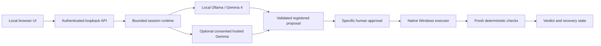

# TroubleShoot

> A local-first Windows troubleshooting assistant that gathers evidence, asks Gemma for a bounded proposal, requests specific approval and checks the outcome.

**Team:** DROS · **Build date:** 8 October 2026 · **Repository:** private

This README describes the integrated implementation on `member-3/backend-hosted-api`, revision `3290250`, including Member 2 `6ed184b` and Member 1 `3edf350`. [PR #1](https://github.com/Team-DROS/TroubleShoot/pull/1) targets main and awaits team agreement before merging. This documentation branch does not itself contain the integrated runtime; use the branch in the setup commands.

## Team

| Member | Completed work recorded in the repository |
| --- | --- |
| Pranesh Subramanian — Member 1 | Windows/desktop executors, guarded mouse primitives, conditional checkbox recovery, guest validation and real Gemma guest harness evidence. |
| Umasuthan Palaniappan — Member 2 | Local Ollama provider, protocol/reasoning, runtime adapter, mouse schemas, configurable decision timeout and real model evidence. |
| Srinath Balakrishnan — Member 3 | Shared contracts, authenticated API/session runtime, approvals/cancellation, hosted transport, minimal UI, native/provider integration, persistent PowerShell transport, packaging and validation. |
| Sanjeev Singotam — Member 4 | Template-aligned documentation, attribution/contribution records, demo script and submission preparation/checklist. |

These are role-based contributions. Git history and the evidence below distinguish authored components, automated tests and live runs; no contribution percentages are claimed.

## Problem Statement

### The Problem

When Windows applications or services fail, people must interpret diagnostic advice, decide which action is appropriate and determine whether it fixed the original symptom. Windows already has automated troubleshooters. Our aim is a limited conversational workflow with visible action approval and measured results.

### Why We Chose This Problem

Troubleshooting should give users evidence and control over consequential changes. This implementation explores that approach with bounded operations. It does not claim to fix every Windows problem.

## Solution

TroubleShoot combines a browser UI, authenticated loopback backend, Gemma adapters and deterministic native executors. The model proposes allowlisted operations; it cannot supply arbitrary commands or executable code. Execution success is separate from symptom restoration.

### Key Features

| Feature | Current status |
| --- | --- |
| Local Ollama `gemma4:e2b` | Implemented and integrated; real inference tested by Members 1/2. No automatic model download or silent fallback. |
| API/session and browser UI | Implemented: provider status, complaint/mode/target, SSE timeline, specific approval, Stop and truthful verdict/recovery. |
| Native diagnostics and stopped-Spooler start | Integrated with fixed arguments, exact approval and conditional service recovery. Intentional faults were guest-only. |
| Fresh target binding | Identity/bounds/DPI comparison and rebinding after inference; five-second freshness remains enforced. |
| Persistent PowerShell transport | Implemented and read-only tested on Windows; caches process/runspace to reduce repeated startup. Guest timing pending. |
| Durable recovery blockers | Private directory and machine marker; pending records block repairs, including after restart. |
| Checkbox recovery | Integrated behind explicit programmatic symptom-verifier injection. Production desktop mutation remains disabled. |
| Mouse/close primitives | Native tools and mouse model schemas exist, but the production runtime excludes these operations. All five mouse exclusions have regression coverage. |
| Hosted Gemma | Implemented and mock-tested; explicit consent and backend-only key. Real hosted inference pending credentials/account access. |
| Capture/vision | Native capture and model image support exist separately; API/UI vision is disabled. Tested guest vision returned unknown and safely blocked input. |

## Innovation and Differentiation

The contribution is conversational coordination of evidence, model proposals, deterministic action policy and verification. Registered tools, specific approval, fresh observations and recovery constrain the model. A click, service state or model explanation is not proof that an unrelated complaint was fixed.

## Technical Implementation

### Architecture



The launcher uses Member 2's single-action runtime adapter, not its separate multistep coordinator. Capture/vision and general desktop repairs are outside the enabled production path.

### Technology Stack

| Category | Implemented technology |
| --- | --- |
| Frontend | HTML, CSS and vanilla JavaScript; no npm build step |
| Backend | Python 3.11+, FastAPI, Uvicorn |
| Local AI | Ollama, default `gemma4:e2b` |
| Hosted AI | Optional Google Gemma API transport; real access unverified |
| Windows tools | Fixed PowerShell workers, .NET UI Automation and guarded native input |
| State | In-memory sessions/events; durable recovery JSON, no database |
| Packaging/testing | Setuptools wheel, Python unittest, Node.js UI behavior tests |
| Deployment | Local loopback application; no public deployment |

### How It Works

The user connects with a session token and submits a complaint, mode, provider and target. The runtime gathers facts and asks the provider for one bounded decision. After inference it re-observes the same target, compares identity/bounds/DPI and binds the proposal to fresh evidence. Changed targets fail closed.

Mutating operations require repair mode and single-use human approval bound to the action and exact native state fingerprint. Approval must finish within the remaining five-second observation window; expiry requires a new run. Native execution repeats its own checks. Persistent transport reduces startup overhead without relaxing freshness or automatically retrying failures.

Fresh deterministic checks produce resolved, partial or unresolved outcomes; cancellation/error are distinct. The current native verifier includes an unmet original-symptom check: Spooler Running can support a partial service-state result, not successful printing. Pending/uncertain recovery blocks further repairs. There is no operator recovery API or automatic startup replay.

### Technical Decisions

- Local is default; hosted text/image sharing requires separate consent. Keys stay on the backend.
- No arbitrary shell, model code, terminal typing or UAC bypass is exposed.
- Diagnose mode prevents registered mutation; cancellation prevents later actions and preserves uncertainty about in-flight changes.
- The server binds to `127.0.0.1`, validates Host/Origin and requires Bearer authentication for API requests. It is a single-user application.
- Production desktop changes remain disabled even with `TROUBLESHOOT_DESKTOP_REPAIRS=1`: no real symptom verifier is integrated. Mouse, close and capture are not runtime model actions.
- Intentional faults and mutation validation belong in a disposable guest with recovery, never on the host.

## Implementation During the Hackathon

This fresh repository contains newly authored provider/reasoning, native tools, API/runtime, hosted transport, UI, packaging, tests and documentation. The team previously worked on another prototype; the user reported that organizers withdrew reuse permission. Its implementation and Git history were not imported here. Prior experience is disclosed, not presented as a formal clean-room guarantee.

### Validation and Live Evidence

**196 Python tests + 5 JavaScript tests pass:** 154 unit, 42 API and 5 web behavior tests. Validation ran on Windows with Python 3.14.3 and Node.js 24.18.0, including Member 1's two Windows-only PowerShell tests. Web tests use a synthetic DOM/transport. Mutation/provider fixtures are synthetic; some transport checks are actual read-only Windows calls.

| Evidence | Result and limits |
| --- | --- |
| Member 3 native read-only session smoke | Actual Windows workers with an explicitly synthetic proposal; partial verdict, no host mutation or model inference. |
| Persistent transport | Three host service queries reused one process: 0.4014, 0.0086 and 0.0042 seconds. Guest timing is not proven. |
| Member 2 CPU Gemma/session | Real inference, approval and simulated execution passed with the 150-second timeout. A resolved fixture verdict is not a Windows repair. |
| Member 1 real Gemma guest harness | Real host-local Gemma text proposal, human approval, native checkbox change, state verification and restoration passed on a synthetic UI. No authenticated API/UI flow or real application symptom was verified. |
| Member 1 native service/mouse checks | Guest service restoration and guarded controller mechanics passed. Running alone does not prove printing. |
| Member 1 vision/print probes | Live capture→Gemma returned unknown and blocked input. Printing was unverified because no printer/PDF driver was installed. |

Wheel build, packaged workers, installed entry point, dependency compatibility and whitespace checks pass. A non-failing TestClient deprecation warning remains. Exact commands and limits: [Member 3 validation][validation], [local model integration evidence][local-evidence], [guest validation][guest-evidence].

## Working Application

**Live Application:** local installation only; no public deployment. Run the integrated Member 3 branch below. Member 3's PC has no reachable local Gemma; the UI reports unavailable honestly. A teammate's existing model is needed for real local inference. Hosted mode needs authorized credentials and explicit consent.

**Pending:** combined real Gemma→authenticated API/UI approval→native guest action→original symptom verification; guest persistent-worker timing; usable capture/vision integration; real hosted inference; a real symptom verifier and operator recovery API before enabling desktop repairs.

## Demo Video

**Demo Video:** no recording/public video link is provided in the verified integration evidence. Member 4 prepared a demo script; its earlier status wording needs reconciliation with current evidence before use. Fixture/harness results must not be described as a full API/UI repair demo.

## Open Source and AI Usage

### AI / Models

- Ollama `gemma4:e2b` is the implemented default. Members 1/2 recorded real inference; their reports disclose execution locality.
- Hosted transport supports `gemma-4-26b-a4b-it` and `gemma-4-31b-it`; real account access/quota/inference remain unverified.
- AI coding assistance was used for fresh implementation. No dataset or fine-tuning is included.

### Open Source Components

Python, FastAPI, Uvicorn, HTTPX, Setuptools and Ollama are third-party components. [MIT License](LICENSE) covers application code; upstream licenses, Gemma terms, API terms and Windows licensing remain separate. See [attribution](docs/ATTRIBUTION.md) and Google's [Gemma API guide](https://ai.google.dev/gemma/docs/core/gemma_on_gemini_api).

## Setup and Usage

### Prerequisites

- Git, Python 3.11+ and Windows in the appropriate interactive session for native tools.
- Existing Ollama `gemma4:e2b` for local inference; startup does not download weights.
- Human elevation for service mutation. Use a disposable guest for repair validation.
- Node.js for web tests only; no Node build/service is needed for the UI.
- Optional backend hosted Gemma key for explicit hosted mode.

### Installation and Running

Use the integrated branch while PR #1 awaits review:

```powershell
git clone https://github.com/Team-DROS/TroubleShoot.git
cd TroubleShoot
git switch member-3/backend-hosted-api
python -m venv .venv
.\.venv\Scripts\python -m pip install -r requirements.lock
$env:PYTHONPATH = 'src'
.\.venv\Scripts\python -m troubleshoot.api --port 8765
```

Open `http://127.0.0.1:8765`, paste the **local session token** printed by the launcher, and click Connect. Use literal `127.0.0.1`, not `localhost`. The token stays in tab memory and travels in an Authorization header; never put it in URLs or recordings. It is distinct from a hosted API key. Restart generates a new token unless configured. `scripts/start.ps1` is an alternative launcher on the integrated branch.

### Environment Variables

| Variable | Default / purpose |
| --- | --- |
| `TROUBLESHOOT_OLLAMA_URL` | `http://127.0.0.1:11434` |
| `TROUBLESHOOT_OLLAMA_MODEL` | `gemma4:e2b` |
| `TROUBLESHOOT_OLLAMA_TIMEOUT` | 150-second decision timeout; production overall run budget is 300 seconds |
| `TROUBLESHOOT_OLLAMA_ALLOW_LAN` | `0`; non-loopback inference needs deliberate opt-in/locality disclosure |
| `TROUBLESHOOT_SESSION_TOKEN` | Optional token, at least 32 ASCII characters; generated when unset |
| `TROUBLESHOOT_RECOVERY_DIR` | Stable private recovery location; default `./data/recovery` |
| `TROUBLESHOOT_DESKTOP_REPAIRS` | Reserved; `1` does not enable production desktop mutation |
| `GEMMA_API_KEY` | Optional backend key; hosted mode also needs user consent |
| `GEMMA_API_MODEL` | `gemma-4-26b-a4b-it` |

Export variables in the backend environment; `.env.example` is not automatically loaded. Member 1's harness used Ollama port 11435, which is not the default. Keep the recovery path stable; pending records require inspection, not deletion or bypass.

### Automated Checks

```powershell
$env:PYTHONPATH = 'src'
.\.venv\Scripts\python -m unittest discover -s tests/unit -q
.\.venv\Scripts\python -m unittest discover -s tests/api -q
node --test tests/e2e/web/app.test.cjs
```

Expected on the validated Windows revision: 154 unit, 42 API and 5 web tests passing. Some worker tests require Windows. [Setup notes][setup] cover packaging and a separately labelled browser fixture; production never substitutes it.

### Usage

Connect, select a permitted target, describe a complaint and choose diagnose/repair mode. Local is default. Review the timeline and approve/reject only the action shown. Approval freshness is five seconds; stale actions require a new run. Stop requests cooperative cancellation. Interpret verdicts against the listed checks and recovery state.

## Challenges and Learnings

CPU inference can outlast freshness, requiring post-inference rebinding that preserves target identity/geometry. Repeated guest PowerShell startup can consume the approval window; persistent transport addresses overhead while keeping policy strict. Explicit fixtures permit API testing without a model/VM, but cannot establish real troubleshooting success. Original-symptom verification is separate from service/control state.

## Devpost Submission

**Devpost Project:** N/A; no verified submission link or acceptance receipt is recorded. The template includes Devpost fields while earlier event notes mention OrganizerHQ. The team must confirm the actual route. No publication/submission is claimed.

## Credits and License

README structure follows the supplied [Hacktoberfest Hack Day Coimbatore template](https://github.com/BIJJUDAMA/hacktoberfest-hack-day-coimbatore-x-init-club-and-idea-club); its application code was not copied. Hosted transport follows Google's Gemma API documentation. External runtimes/models retain their own terms. Application code uses [MIT License](LICENSE).

## Submission Checklist

- [x] Four names and completed role-based contributions recorded.
- [x] Fresh provider, native tools, API/UI and packaging integrated on Member 3's branch.
- [x] 196 Python and 5 web tests passed, with simulations identified.
- [x] Real model/native guest harness evidence recorded with limits.
- [x] Repository private; remaining work described honestly.
- [ ] Team review/agreement to merge PR #1 into main.
- [ ] Authenticated API/UI guest run and persistent-worker guest timing.
- [ ] Real symptom verification and recovery workflow before enabling desktop repairs.
- [ ] Capture/vision integration and hosted live inference if included in demo scope.
- [ ] Reconcile Member 4's older contribution/demo/checklist documents with current results.
- [ ] Supply any required fresh recording and verified submission receipt.
- [ ] Team lead explicitly authorizes publication if required.

[validation]: https://github.com/Team-DROS/TroubleShoot/blob/3290250/docs/MEMBER_3_VALIDATION.md
[setup]: https://github.com/Team-DROS/TroubleShoot/blob/3290250/docs/MEMBER_3_SETUP.md
[local-evidence]: https://github.com/Team-DROS/TroubleShoot/blob/3290250/docs/evidence/local-model/INTEGRATION_MEMBER3.md
[guest-evidence]: https://github.com/Team-DROS/TroubleShoot/blob/3290250/docs/VALIDATION.md
